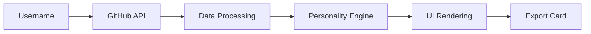

<!-- HEADER -->
<p align="center">
  
</p>

<p align="center">
  
  
  
  
</p>

---

##  GitHub Personality Analyzer

<p align="center">
  <b>Transform GitHub profiles into personality insights, developer behavior, and shareable identity.</b>
</p>

---

##  Overview

GitHub Personality Analyzer converts public GitHub activity into meaningful insights:

- Personality traits
- Coding behavior patterns
- Aura, Chaos, and developer metrics
- Recruiter-style evaluation
- Shareable developer identity cards

Built as a vibecoded project, combining creativity, experimentation, and logic.

---

##  Why This Project

Most tools show numbers.
This project focuses on interpreting the developer behind the code.

It helps answer:

- What kind of developer are you?
- How chaotic is your coding style?
- What impression do recruiters get?

---

##  Features

- Analyze any public GitHub profile
- Real-time GitHub API integration
- Personality & behavior insights
- Custom metrics (Aura, Chaos, Energy)
- Downloadable shareable cards

---

##  Screenshots

<p align="center">
  
  
  
</p>

<p align="center">
  
  
  
</p>

---

##  How It Works



---

##  Project Structure

```
github-personality-analyzer/
│
├── src/
│   ├── components/
│   │   ├── SearchBar.tsx
│   │   ├── ProfileCard.tsx
│   │   ├── RepoCard.tsx
│   │   ├── RepoList.tsx
│   │   ├── PersonalityCard.tsx
│   │   ├── RoastCard.tsx
│   │   ├── LanguageChart.tsx
│   │   ├── SkillChart.tsx
│   │   ├── ContributionGraph.tsx
│   │   ├── RecentSearches.tsx
│   │   ├── LoadingScreen.tsx
│   │   └── ErrorState.tsx
│   │
│   ├── services/
│   │   └── githubApi.ts
│   │
│   ├── utils/
│   │   ├── calculateLanguageStats.ts
│   │   ├── generatePersonality.ts
│   │   ├── roastGenerator.ts
│   │   ├── calculateSkills.ts
│   │   └── formatDate.ts
│   │
│   ├── types/
│   │   └── github.ts
│   │
│   ├── pages/
│   │   └── Home.tsx
│   │
│   ├── App.tsx
│   ├── main.tsx
│   └── index.css
```

---

##  Installation

```bash
git clone https://github.com/theswaxtik/github-personality-analyzer.git

cd github-personality-analyzer

npm install

npm run dev
```

---

##  Usage

1. Enter a GitHub username
2. Click Analyze
3. View personality insights
4. Export shareable card

---

##  Current Issues

- Improper text alignment in downloaded cards
- UI spacing inconsistencies across components
- Font rendering issues in exported images
- Limited personality dataset
- Repetitive output patterns
- Minor glitches during API loading

---

##  Contributing

Contributions are welcome.

You can:

- Fix UI/UX issues
- Improve card layout
- Expand personality dataset
- Optimize performance
- Enhance analysis logic

```bash
git checkout -b feature/your-feature

git commit -m "Add improvement"

git push origin feature/your-feature
```

---

##  Roadmap

- Expand personality dataset significantly
- Improve UI/UX consistency
- Advanced card generation system
- AI-enhanced personality analysis
- Mobile-first optimization

---

##  Credits

- Swastik (TechX) — Developer
- Claude AI — Logic & refinement

---

##  License

MIT License

---

##  Support

<p align="center">
  
  
  
</p>

---

##  Final Note

<p align="center">
  <b>Your GitHub profile reflects more than code — it reflects your developer identity.</b>
</p>
